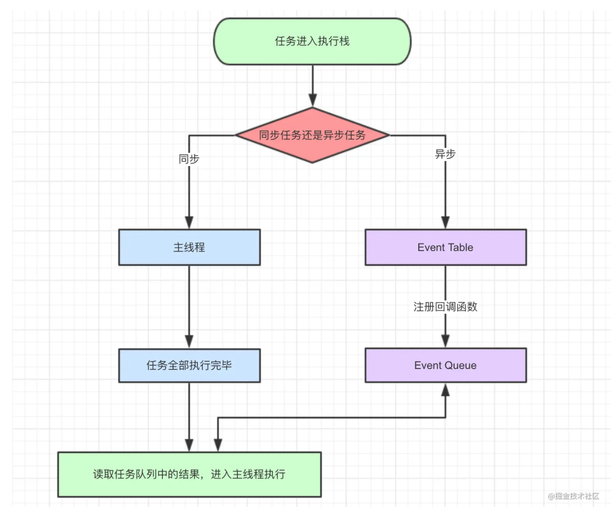

## 概念
javascript是一门单线程语言，在最新的HTML5中提出了Web-Worker，但javascript是单线程这一核心仍未改变。
所以一切javascript版的"多线程"都是用单线程模拟出来的;

当我们打开网站时，网页的渲染过程就是一大堆同步任务，比如页面骨架和页面元素的渲染。
而像加载图片音乐之类占用资源大耗时久的任务，就是异步任务。

不管是什么新框架新语法糖实现的所谓异步，其实都是用同步的方法去模拟的，牢牢把握住单线程这点非常重要

事件循环是js实现异步的一种方法，也是js的执行机制。

javascript在不同的环境下，比如node，浏览器，Ringo等等，执行方式是不同的。而运行大多指javascript解析引擎，是统一的


## 同步与异步流程(广义)
1. 同步和异步任务分别进入不同的执行"场所"，同步的进入主线程，异步的进入Event Table并注册函数。
2. 当指定的事情完成时，Event Table会将这个函数移入Event Queue。
3. 主线程内的任务执行完毕为空，会去Event Queue读取对应的函数，进入主线程执行。
4. 上述过程会不断重复，也就是常说的Event Loop(事件循环)。

注：怎么监控主线程执行栈是否为空？
js引擎存在monitoring process进程，会持续不断的检查主线程执行栈是否为空，一旦为空，
就会去Event Queue那里检查是否有等待被调用的函数。

## 示例
```javascript
let data = [];
$.ajax({
    url:www.javascript.com,
    data:data,
    success:() => {
        console.log('发送成功!');
    }
})
console.log('代码执行结束');

1. ajax进入Event Table，注册回调函数success。
2. 执行console.log('代码执行结束')。
3. ajax事件完成，回调函数success进入Event Queue。
4. 主线程从Event Queue读取回调函数success并执行。

```

## setTimeout
setTimeout(fn,0)的含义是，指定某个任务在主线程最早可得的空闲时间执行，意思就是不用再等多少秒了，
只要主线程执行栈内的同步任务全部执行完成，栈为空就马上执行。

## setInterval
对于执行顺序来说，setInterval会每隔指定的时间将注册的函数置入Event Queue，如果前面的任务耗时太久，那么同样需要等待。

对于setInterval(fn,ms)来说，我们已经知道不是每过ms秒会执行一次fn，
而是每过ms秒，会有fn进入Event Queue。
一旦setInterval的回调函数fn执行时间超过了延迟时间ms
，那么就完全看不出来有时间间隔了

## 微任务和宏任务(任务精细定义)
macro-task(宏任务)：包括整体代码script，setTimeout，setInterval
micro-task(微任务)：Promise，process.nextTick

不同类型的任务会进入对应的Event Queue，比如setTimeout和setInterval会进入相同的Event Queue。

事件循环的顺序，决定js代码的执行顺序。进入整体代码(宏任务)后，开始第一次循环。接着执行所有的微任务。
然后再次从宏任务开始，找到其中一个任务队列执行完毕，再执行所有的微任务

```javascript
setTimeout(function() {
    console.log('setTimeout');
})

new Promise(function(resolve) {
    console.log('promise');
}).then(function() {
    console.log('then');
})

console.log('console');


```

* 这段script代码作为宏任务，进入主线程。
* 先遇到setTimeout，那么将其回调函数注册后分发到宏任务Event Queue。(注册过程与上同，下文不再描述)
* 接下来遇到了Promise，new Promise立即执行，then函数分发到微任务Event Queue。
* 遇到console.log('promise')，立即执行。
* 整体代码script作为第一个宏任务执行结束，看看有哪些微任务？我们发现了then在微任务Event Queue里面，执行。
* ok，第一轮事件循环结束了，我们开始第二轮循环，当然要从宏任务Event Queue开始。我们发现了宏任务Event Queue中setTimeout对应的回调函数，立即执行。

