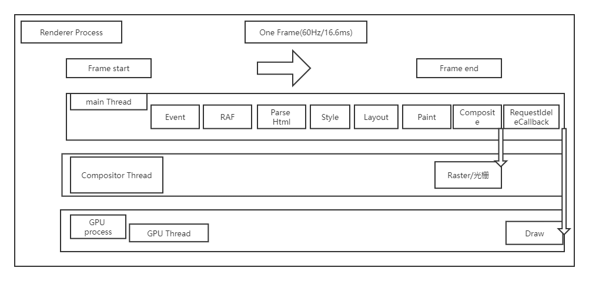
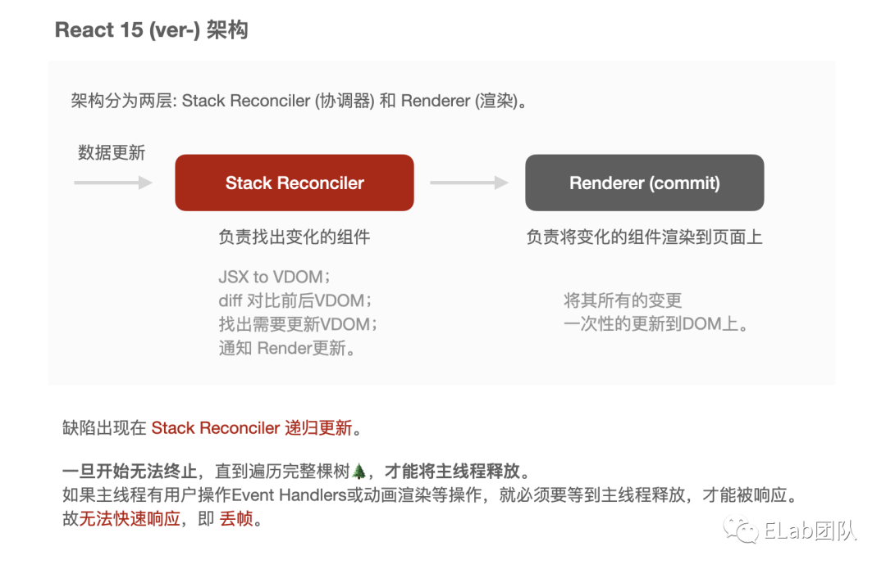

## 1.1 渲染帧
帧 (frame): 动画过程中，每一幅静止的画面叫做帧。

帧率 (frame per second): 即每秒钟播放的静止画面的数量。

帧时长 (frame running time): 每一幅静止的画面的停留时间。

丢帧 (dropped frame): 当某一帧时长高于平均帧时长。
- 一般来说浏览器刷新率在60Hz, 渲染一帧时长必须控制在16.67ms (1s / 60 = 16.67ms)。
- 如果渲染超过该时间, 对用户视觉上来说，会出现卡顿现象，即丢帧 (dropped frame)。

## 1.2 帧生命周期


```
简单描述一帧的生命周期:

1. 一帧开始。

2. 主线程:

- Event Handlers: UI交互输入的事件回调, 例如input、click、wheel等。

- RAF: 执行requestAnimationFrame回调。

- DOM Tree: 解析HTML, 构建DOM Tree, 当JS对DOM有变更会重新触发该流程。

- CSS Tree: 构建CSS Tree。至此构建出Render Tree。

- Layout: 所有元素的position、size信息。

- Paint: 像素填充, 例如颜色、文字、边框等可视部分。

- Composite: 绘制的指令信息传到合成线程中。

- RequestIdleCallback: 如果此时一帧还有空余时间, 则执行该回调。

3. 合成线程:

- Raster: 合成线程将信息分块, 并把每块发送给光栅线程, 光栅线程创建位图, 并通知GPU进程刷新这一帧。

4. 一帧结束。
```

## 1.3 丢帧实验
怎么就丢帧了呢?
对于流畅的动画，如果一帧处理时间超过16ms，就能感到页面的卡顿了。

当用户点击任一按键 A，B，C，因为主线程执行Event Handlers任务，动画因为浏览器不能及时处理下一帧，导致动画出现卡顿的现象。

```
// 处理同步任务，并占用主线程

const bindClick = id => 

  element(id).addEventListener('click', Work.onSyncUnit)

// 绑定click事件

bindClick('btnA')

bindClick('btnB')

bindClick('btnC')


var Work = {

   // 有1万个任务

   unit: 10000,

   // 处理每个任务

   onOneUnit: function () {  for (var i = 0; i <= 500000; i++) {} },

   // 同步处理: 一次处理完所有任务

   onSyncUnit: function () {

      let _u = 0

      while (_u < Work.unit) {

         Work.onOneUnit()

         _u ++

      }

    }

 }
```

通过Chrome DevTool 中 Performance中可查看

## 1.4 解决丢帧
上述，我们发现 JS运算是占用渲染的时间的。

在连续动画中，要做高耗时的操作，如何保证帧平稳呢？

**解决丢帧思考如下:**
1. 一帧空闲时处理, 利用 RequestIdleCallback[4] 处理任务。
>window.requestIdleCallback()方法将在浏览器的空闲时段内调用的函数排队。这使开发者能够在主事件循环上执行后台和低优先级工作，而不会影响延迟关键事件，如动画和输入响应。函数一般会按先进先调用的顺序执行，然而，如果回调函数指定了执行超时时间timeout，则有可能为了在超时前执行函数而打乱执行顺序。

2. 对高耗时的任务，进行分步骤处理（或Web worker）。
将一个高耗时js任务分为 多个子js任务，在reqestIdleCallback中调用

```
const bindClick = id => 

  element(id).addEventListener('click', Work.onAsyncUnit)

// 绑定click事件

bindClick('btnA')

bindClick('btnB')

bindClick('btnC')


var Work = {

    // 有1万个任务

    unit: 10000,

    // 处理每个任务

    onOneUnit: function () {  for (var i = 0; i <= 500000; i++) {} },

    // 异步处理

    onAsyncUnit: function () {

        // 空闲时间 1ms

        const FREE_TIME = 1

        let _u = 0


        function cb(deadline) {

            // 当任务还没有被处理完 & 一帧还有的空闲时间 > 1ms

            while (_u < Work.unit && deadline.timeRemaining() > FREE_TIME) {

                Work.onOneUnit()

                _u ++

            }

            // 任务干完, 执行回调

            if (_u >= Work.unit) {

                // 执行回调

                return

            }

            // 任务没完成, 继续等空闲执行

            window.requestIdleCallback(cb)

        }

        window.requestIdleCallback(cb)

    }

}
```

requestIdleCallback 启发
将一个大任务分割成N个小任务，在每一帧有空余时间情况下，逐步去执行小任务。

## 2.React15 (-) 架构缺点
递归 Recursion: 利用 调用栈[9]，实现自己调用自己的方法。
## 2.1 概述原因


## 2.2 流程和代码解析
可能需要你有点 深度优先遍历、递归、回溯思想、🌲 等数据结构的知识。

[](https://mp.weixin.qq.com/s/GDYfwQyIKOjqfC_n-oDPzQ)
