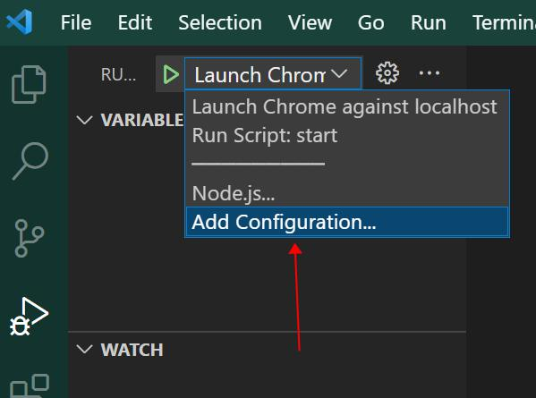
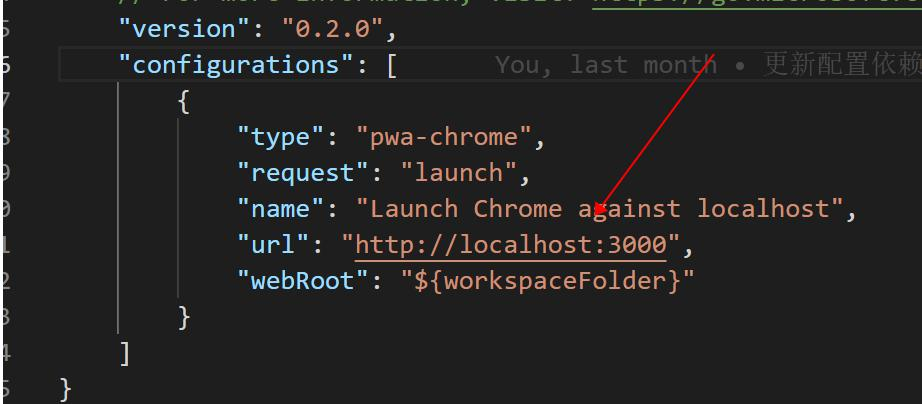
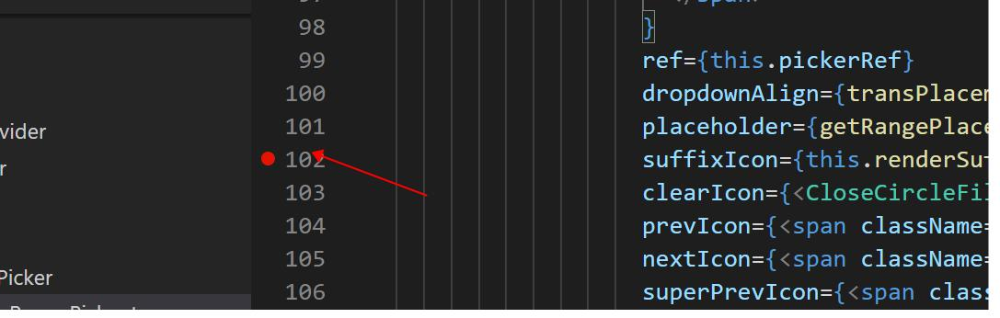
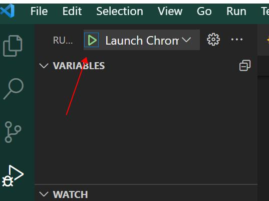

## React 开启 代码区调试

1. 运行项目 `yarn start`,获取到访问地址，例如： http://localhost:3000

2. 创建 settings.json 中 launch.json (修改当前运行 地址)


3. 设置代码中断点

4. 运行 debugger


## Vue 调试 (针对 vue-cli)
1. 添加 launch.json
```
{
  "version": "0.2.0",
  "configurations": [
    {
      "type": "node",
      "request": "launch",
      "name": "Launch Program",
      "program": "${workspaceFolder}\\node_modules\\@vue\\cli-service\\bin\\vue-cli-service.js",
      "args": ["serve"]
    }
  ]
}

```

2. vscode 中 debugger 运行
3. 在代码中设置（debugger）


## Chrome 调试
```
// 代码中写
debugger
```