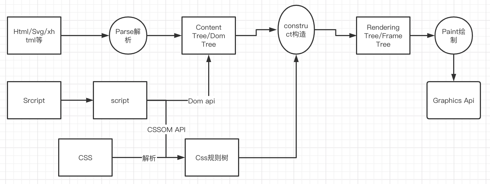
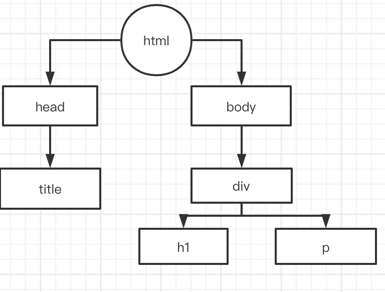
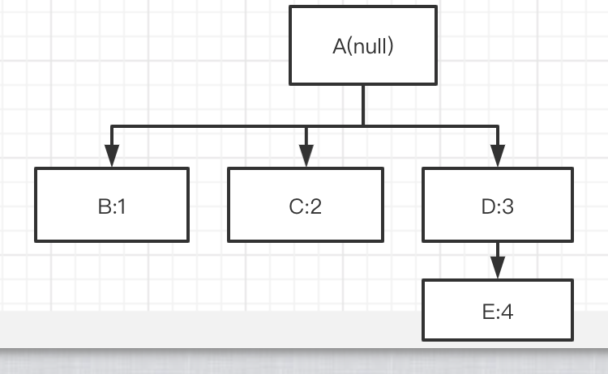
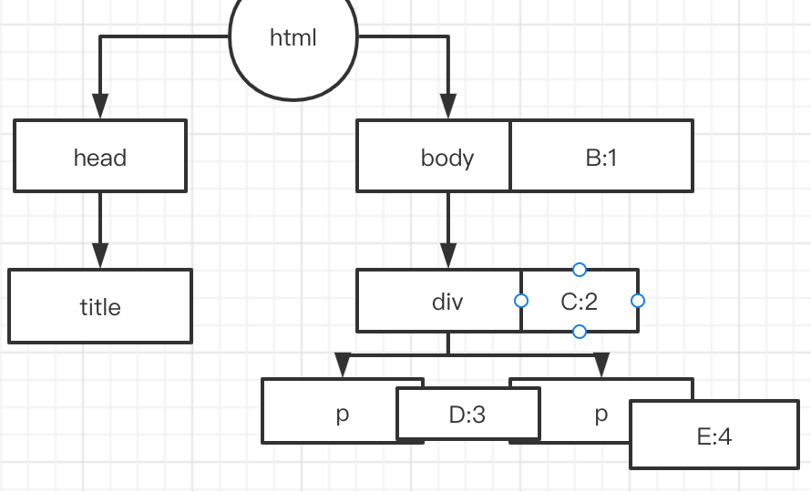

## 浏览器渲染原理

1. 浏览器会经过三种解析：
- 一个是HTML/SVG/XHTML，事实上，Webkit有三个C++的类对应这三类文档。解析这三种文件会产生一个DOM Tree。
- CSS，解析CSS会产生CSS规则树。
- Javascript，脚本，主要是通过DOM API和CSSOM API来操作DOM Tree和CSS Rule Tree.

2. 解析完成后，浏览器引擎会通过DOM Tree 和 CSS Rule Tree 来构造 Rendering Tree。注意：
- Rendering Tree 渲染树并不等同于DOM树，因为一些像Header或display:none的东西就没必要放在渲染树中了
- CSS 的 Rule Tree主要是为了完成匹配并把CSS Rule附加上Rendering Tree上的每个Element。也就是DOM结点。也就是所谓的Frame。
- 计算每个Frame（也就是每个Element）的位置，这又叫layout和reflow过程。
- 最后通过调用操作系统Native GUI的API绘制。



### DOM解析
```html
<html>
<head>
<title>test</title>
</head>
<body>
	<div class="title">
	<p>test<p>
	<p class="text">jkjkk</p>
	</div>
</body>
</html>

```
解析如下:


### CSS 解析
```css
  /* rule 1 */ body { display: block; text-indent: 1em; }
/* rule 2 */ title { display: block; font-size: 3em; }
/* rule 3 */ p { display: block; }
/* rule 4 */ .text { font-style: italic; }
```

```
注意:
建立CSS Rule Tree是需要比照着DOM Tree来的。
CSS匹配DOM Tree主要是从右到左解析CSS的Selector，好多人以为这个事会比较快，其实并不一定。关键还看我们的CSS的Selector怎么写了;
CSS匹配HTML元素是一个相当复杂和有性能问题的事情。需要注意DOM树要小，CSS尽量用id和class，千万不要过渡层叠下去等;

通过这两个树，我们可以得到一个叫Style Context Tree，也就是（把CSS Rule结点Attach到DOM Tree上);
```


Firefox基本上来说是通过CSS 解析 生成 CSS Rule Tree，然后，通过比对DOM生成Style Context Tree，然后Firefox通过把Style Context Tree和其Render Tree（Frame Tree）关联上，就完成了。
注意：Render Tree会把一些不可见的结点去除掉,而Firefox中所谓的Frame就是一个DOM结点;

Webkit不像Firefox要用两个树来干这个，Webkit也有Style对象，它直接把这个Style对象存在了相应的DOM结点上了;

### 渲染
渲染的流程基本上如下：
1. 计算CSS样式
2. 构建Render Tree
3. Layout – 定位坐标和大小，是否换行，各种position, overflow, z-index属性 等
4. 开始绘制

Javascript动态修改了DOM属性或是CSS属会导致重新Layout;
两个概念：

- Repaint(重绘)——屏幕的一部分要重画，比如某个CSS的背景色变了。但是元素的几何尺寸没有变。

- Reflow（回流)——意味着元件的几何尺寸变了，我们需要重新验证并计算Render Tree。
是Render Tree的一部分或全部发生了变化。这就是Reflow，或是Layout。
（HTML使用的是flow based layout，也就是流式布局，所以，如果某元件的几何尺寸发生了变化，需要重新布局，也就叫reflow）
reflow 会从<html>这个root frame开始递归往下，依次计算所有的结点几何尺寸和位置，
在reflow过程中，可能会增加一些frame，比如一个文本字符串必需被包装起来。

注: Reflow的成本比Repaint的成本高得多的多。
DOM Tree里的每个结点都会有reflow方法，一个结点的reflow很有可能导致子结点，
甚至父点以及同级结点的reflow。
在一些高性能的电脑上也许还没什么，但是如果reflow发生在手机上，那么这个过程是非常痛苦和耗电的。

这些动作有很大可能会是成本比较高的:
- 当你增加、删除、修改DOM结点时，会导致Reflow或Repaint
- 当你移动DOM的位置，或是搞个动画的时候。
- 当你修改CSS样式的时候。
- 当你Resize窗口的时候（移动端没有这个问题），或是滚动的时候。
- 当你修改网页的默认字体时。

注：display:none会触发reflow，而visibility:hidden只会触发repaint，因为没有发现位置变化。

通常来说，如果在滚屏的时候，我们的页面上的所有的像素都会跟着滚动，那么性能上没什么问题，因为我们的显卡对于这种把全屏像素往上往下移的算法是很快。
但是如果你有一个fixed的背景图，或是有些Element不跟着滚动，有些Elment是动画，那么这个滚动的动作对于浏览器来说会是相当相当痛苦的一个过程。你可以看到很多这样的网页在滚动的时候性能有多差。因为滚屏也有可能会造成reflow。

reflow有几个原因:
- Initial。网页初始化的时候。
- Incremental。一些Javascript在操作DOM Tree时。
- Resize。其些元件的尺寸变了。
- StyleChange。如果CSS的属性发生变化了。
- Dirty。几个Incremental的reflow发生在同一个frame的子树上。

### 浏览器reflow与repain机制
一般来说，浏览器会把这样的操作积攒一批，然后做一次reflow，这又叫异步reflow或增量异步reflow。但是有些情况浏览器是不会这么做的，比如：resize窗口，改变了页面默认的字体，等。对于这些操作，浏览器会马上进行reflow。

但是有些时候，我们的脚本会阻止浏览器这么干，比如：如果我们请求下面的一些DOM:
1. offsetTop, offsetLeft, offsetWidth, offsetHeight
2. scrollTop/Left/Width/Height
3. clientTop/Left/Width/Height
4. IE中的 getComputedStyle(), 或 currentStyle

浏览器需要返回最新的值，而这样一样会flush出去一些样式的改变，从而造成频繁的reflow/repaint

### 减少reflow/repaint

1. 不要一条一条地修改DOM的样式。与其这样，还不如预先定义好css的class，然后修改DOM的className。

2. 把DOM离线后修改
使用documentFragment 对象在内存里操作DOM
先把DOM给display:none(有一次reflow)，然后你想怎么改就怎么改。比如修改100次，然后再把他显示出来。
clone一个DOM结点到内存里（虚拟DOM），然后想怎么改就怎么改，改完后，和真实DOM的那个的交换一下。

3. 不要把DOM结点的属性值放在一个循环里当成循环里的变量。不然这会导致大量地读写这个结点的属性。
4. 尽可能的修改层级比较低的DOM。当然，改变层级比较底的DOM有可能会造成大面积的reflow，但是也可能影响范围很小。
5. 为动画的HTML元件使用fixed或absoult的position，那么修改他们的CSS是不会reflow的。
6. 千万不要使用table布局。因为可能很小的一个小改动会造成整个table的重新布局。

### 查询渲染性能工具
1. Google的SpeedTracer是个非常强悍的工作让你看看你的浏览渲染的成本有多大。其实Safari和Chrome都可以使用开发者工具里的一个Timeline;
2. Firefox下这个基于Firebug的叫Firebug Paint Events的插件也不错
3. IE下你可以用一个叫dynaTrace的IE扩展。