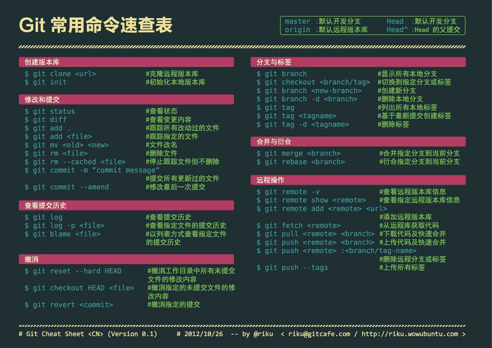

## Git 命令操作手册

[](https://mp.weixin.qq.com/s/apIB-N7zyWYSG6sxrFzT9Q)

## git cherry-pick概念
>多分支的代码库，将代码从一个分支转移到另一个分支;分两种情况。一种情况是，你需要另一个分支的所有代码变动，那么就采用合并（git merge）。另一种情况是，你只需要部分代码变动（某几个提交），这时可以采用 Cherry pick

```
http://www.ruanyifeng.com/blog/2020/04/git-cherry-pick.html
```

```
# 切换到 master 分支
$ git checkout master

# Cherry pick 操作
$ git cherry-pick [commitHash]
```

## tag 和branch的区别
Git tag是一系列commit的中的一个点，只能查看，不能移动。
branch是一系列串联的commit的线。

## git tag的用法
我们常常在代码封板时,使用git 创建一个tag ,这样一个不可修改的历史代码版本就像被我们封存起来一样,不论是运维发布拉取,或者以后的代码版本管理,都是十分方便的

git 下打标签其实有2种情况
- 轻量级的：它其实是一个独立的分支,或者说是一个不可变的分支.指向特定提交对象的引用
- 带附注的：实际上是存储在仓库中的一个独立对象，它有自身的校验和信息，包含着标签的名字，标签说明，标签本身也允许使用 GNU Privacy Guard (GPG) 来签署或验证,电子邮件地址和日期，一般我们都建议使用含附注型的标签，以便保留相关信息

## 创建tag
```
git tag -a V1.0 -m 'release 1.0'
```
上面的命令我们成功创建了本地一个版本 V1.0 ,并且添加了附注信息 ‘release 1.0’
## 查看tag
```
git tag
```

## 要显示附注信息,我们需要用 show 指令来查看

```
git show V1.0
```

## 但是目前这个标签仅仅是提交到了本地git仓库.如何同步到远程代码库
```
git push origin --tags
```

## 如果刚刚同步上去,你缺发现一个致命bug ,需要重新打版本,现在还为时不晚.

```
git tag -d V1.0
```

到这一步我们只是删除了本地 V1.2的版本,可是线上V1.2的版本还是存在,如何办?
这时我们可以推送的空的同名版本到线上,达到删除线上版本的目标:
```
git push origin :refs/tags/V1.0
```

## 如何获取远程版本?
```
git fetch origin tag V1.0
```
这样我们可以精准拉取指定的某一个版本.适用于运维部署指定版本.

## git出现warning: LF will be replaced by CRLF的解决方法
这是因为跨平台开发下产生的。由于编辑器的不同或者Windows程序员在跨平台项目中的文件行尾加入了回车换行符;
```
git config core.autocrlf

```

- 因为Windows使用回车和换行两个字符来结束一行，而Mac和Linux只使用换行一个字符
- Git可以在你提交时自动地把行结束符CRLF转换成LF，而在签出代码时把LF转换成CRLF。用core.autocrlf来打开此项功能， 如果是在Windows系统上，把它设置成true，这样当签出代码时，LF会被转换成CRLF：
```
git config --global core.autocrlf true

```

### 注意
```
CR：Carriage Return，对应ASCII中转义字符\r，表示回车
LF：Linefeed，对应ASCII中转义字符\n，表示换行
CRLF：Carriage Return & Linefeed，\r\n，表示回车并换行
```

### 通过配置.gitattributes
现在，任何人从仓库获取代码后，创建以及修改文件时，git 都会自动地设置好正确的文件结尾。
```
*.js    eol=lf
*.jsx   eol=lf
*.json  eol=lf
```
通过Ctrl+Shift+p => reload Window

## 创建一个本地分支
```
git branch 分支名

```

## 要想切换分支，就需要使用gIt checkout命令
```
//切换分支
% git checkout testing
​
//查看分支
% git branch -a
  master
* testing

```

## 合并分支
```
% git merge testing  
//可以基于master进行push或者继续提交代码

```

## 合并后如果你不想要testing分支，可以将该分支进行删除
```
git branch -d testing

```

## 分支冲突时如何合并
```
 % git merge testing
Auto-merging test.md
CONFLICT (content): Merge conflict in test.md

```

## 查看所有分支
```
 % git branch
* master
  test
// *号代表现在检出的那一个分支（也就是说，当前 HEAD 指针所指向的分支）
```

## 查看每一个分支最后提交
```
% git branch -v
* master bc5b518 [ahead 5] sss
  test   1be830c ss

```

## 查看所有本地分支对应跟踪的远程分支
```
 % git branch -vv             
  master d230c50 [origin/master: ahead 6] ss
* test   1be830c ss
// master对应的远程分支是origin/master，test还没有和远程分支建立关联
```

## 设置已有的本地分支跟踪一个远程分支
```
% git branch -u origin/master
​
% git branch -vv             
  master d230c50 [origin/master: ahead 6] ss
* test   1be830c [origin/master] ss
​
// 该命令会将当前所使用的本地分支与一个远程分支建立映射关系，当然此命令也可以作为修改对应的远程分支

```

## 删除远程分支
```
% git push origin --delete 远程分支名

```

## ===================
```
stash：存储临时代码。
reset --soft：软回溯，回退 commit 的同时保留修改内容。
cherry-pick：复制 commit。
revert：撤销 commit 的修改内容。
reflog：记录了 commit 的历史操作。
```

##==================== 封存代码修改
```
git stash

# 保存当前未commit的代码
git stash

# 保存当前未commit的代码并添加备注
git stash save "备注的内容"

# 列出stash的所有记录
git stash list

# 删除stash的所有记录
git stash clear

# 应用最近一次的stash
git stash apply

# 应用最近一次的stash，随后删除该记录
git stash pop

# 删除最近的一次stash
git stash drop

# 列出stash
$ git stash list

# 应用
git stash apply stash@{1}
```


## 恢复最近一次 commit （并且 commit 之后 的提交 保存到暂缓区）
```
git reset --soft HEAD^
```

## 一次转移多个提交：(上面的命令将 commit1 和 commit2 两个提交应用到**当前分支**)
```
git cherry-pick commit1 commit2

```

## 多个连续的commit，也可区间复制：
```
git cherry-pick commit1^..commit2

```

## cherry-pick 冲突时继续
```
git cherry-pick --continue
```

## 放弃 cherry-pick：回到操作前的样子，就像什么都没发生过
```
gits cherry-pick --abort

```

## 退出 cherry-pick：不回到操作前的样子。即保留已经 cherry-pick 成功的 commit
```
git cherry-pick --quit

```

## 撤销自己的提交
git revert (commitHash)
```
git revert 21dcd937fe555f58841b17466a99118deb489212      
```

## 合并提交，撤销问题
- 通常无法 revert 合并，因为您不知道合并的哪一侧应被视为主线。此选项指定主线的父编号（从1开始），并允许 revert 反转相对于指定父编号的更改
- 因为合并提交是两条分支的交集节点，而 git 不知道需要撤销的哪一条分支，需要添加参数 -m 指定主线分支，保留主线分支的代码，另一条则被撤销。
```
#-m 后面要跟一个 parent number 标识出"主线"，一般使用 1 保留主分支代码。

git revert -m 1 <commitHash>

```

## revert 合并提交后，再次合并分支会失效
需要 revert 掉之前 revert 的合并提交;

## 撤销 错误提交
```
# 历史记录：查看错误提交 commmitHash并记录
git reflog 

# revert 撤销 这条commit 
# 
git reset --hard commitHash
```